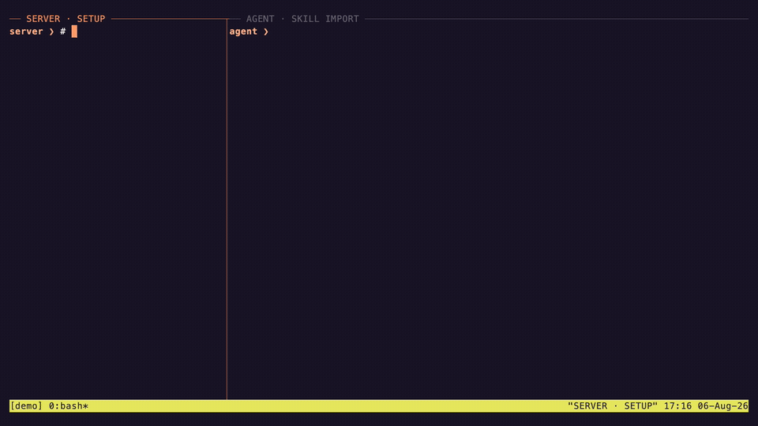

# 📜 OpenLore

[](https://github.com/aakarim/go-openlore/releases/latest)
[](https://pkg.go.dev/github.com/aakarim/go-openlore)
[](#deploy-on-flyio)
[](https://railway.com/deploy/openlore?utm_medium=integration&utm_source=button&utm_campaign=openlore)

Sponsored by <a href="https://oiya.ai/?utm_source=github&amp;utm_medium=referral&amp;utm_campaign=openlore&amp;utm_content=sponsor_logo"></a>

**Serve your docs to AI agents over SSH.**

OpenLore is a minimal, extensible, agent-native knowledge base that keeps shared context current and inspectable.

---

## About

AI coding agents already know how to explore files with `ls`, `cat`, `grep`,
`find`, pipes, and shell loops. OpenLore gives them that same interface over
SSH, backed by your documentation instead of a real machine.

```text
Agent ──SSH or MCP──▶ OpenLore ──▶ docs, knowledge, and artifacts
```

It starts as a single-binary, zero-config, read-only documentation server. When
you need a live knowledge base, you can add identity-scoped access, controlled
publishing, atomic writes, validation, and human approval without changing how
agents read or navigate the content.

### Store and retrieve Markdown

Put documentation, runbooks, project context, or agent-authored notes in
ordinary Markdown files. There is no ingestion pipeline: point OpenLore at a
directory and it serves the existing hierarchy directly. Organize documents
with folders, connect them with standard Markdown links, and group them into
docsets when different people or agents need different access. OpenLore is
read-only by default; enable writing when you want agents to create and update
Markdown too.

[](assets/demo/v0.4.0/openlore-skills-import.mp4)

## Quick Start

The fastest path is to let your agent set up OpenLore:

```bash
# Teach your agent how to install, configure, and bundle OpenLore
ssh openlore.sh teach | your-agent-cli

# Add documentation access instructions to AGENTS.md
ssh openlore.sh agents >> AGENTS.md
```

Or install and run it directly:

```bash
go install github.com/aakarim/go-openlore/cmd/openlore@latest

openlore ./docs

ssh -p 2222 localhost
ssh -p 2222 localhost "grep -r 'authentication' /docs"
```

By default this starts:

- SSH on `localhost:2222`
- the human-facing web view on `http://localhost:8080`
- MCP over HTTP on `http://localhost:8080/mcp`

See [Installation](#installation) for more ways to install and package OpenLore.

## Features

- **Agent-native retrieval** — Agents use the shell tools and composition
  patterns they already understand instead of learning a bespoke retrieval API.
- **One knowledge surface, multiple transports** — Serve the same virtual
  filesystem over SSH, SFTP/SSHFS, MCP, and a human-friendly web view.
- **Live, governed knowledge** — Keep content read-only, allow scoped publishing,
  or enable full writes per docset. Writes are atomic, conflict-aware, and can
  require human approval.
- **Identity-scoped views** — Give each person or agent only the docsets it
  needs, with role-based `ro`, `publish`, and `rw` grants, path aliases, and
  private home directories.
- **Safe by construction** — The shell is an in-memory Go interpreter, not a
  real operating-system shell. There is no shell escape, arbitrary process
  execution, or ambient network access in a normal session.
- **Portable knowledge bundles** — Embed docs into a self-contained binary,
  build cross-platform bundles with the GitHub Action, or package them as a
  desktop MCP extension.
- **Structured knowledge without a new query language** — Inspect frontmatter
  as NDJSON with `lore meta`, query it with `jq`, and validate Google's
  [Open Knowledge Format (OKF)](https://github.com/GoogleCloudPlatform/knowledge-catalog/blob/main/okf/SPEC.md)
  bundles and Agent Skills close to the write path.
- **Extensible policy and processing** — Plugins can add validation, grants,
  read/write middleware, metadata, and post-commit processing while preserving
  the same filesystem interface.

## Use Cases

- **Continuous Learning repository** - store sessions and learnings in one shared server. Add metrics so you can optimise. Allow agents to share learnings with each other while maintaining user isolation.
- **Team Artifact Repository** - share markdown, HTML, JSON, Excel etc. documents you've created while maintaining access controls. Much more natural than git, more agent-native than Confluence/Notion. 
- **Documentation for coding agents** — Put internal API docs, runbooks, product
  context, and architecture notes behind a familiar, greppable interface.
- **A shared live memory for teams of agents** — Give agents separate or shared
  docsets so they can publish findings, hand off work, and accumulate durable
  context across sessions.
- **Public docs site** - add any files to your public docset, enable public access and it will be shown to any agent that stumbles across your site. Improves AEO/GEO with no need to edit your existing docs. 
- **Skills sharing** — Publish Agent Skills into shared collections so every
  authorized agent can discover and use the same governed procedures.
- **Agent Plugins repository** — Version-pin [Agent Plugins](https://agent-plugins.org) repos from GitHub and serve them to your team's agents. Skills packaged in the open standard stay current automatically.
- **Governed knowledge contribution** — Let contributors publish into inboxes
  while reserving sensitive paths for approvers and preventing accidental
  overwrites.
- **Remote review of agent artifacts** — Expose reports, logs, screenshots, and
  generated files through the browser or SSH without building a custom artifact
  viewer or granting access to the agent's machine.
- **Identity-specific workspaces** — Mount a private home for each agent plus
  shared team knowledge, all through one server and one authorization model.
- **Portable customer or project knowledge** — Ship a versioned executable with
  the relevant docs embedded, or distribute the same knowledge as an MCPB
  desktop extension.
- **Validated knowledge catalogs** — Enforce frontmatter and bundle conventions,
  inspect metadata cheaply, and stop malformed knowledge at admission time.

## How It Works

OpenLore is built on [Wish](https://github.com/charmbracelet/wish) for SSH
transport. A connection is handled entirely against a virtual filesystem:

1. **Authenticate** — connect keylessly or resolve an SSH key, certificate,
   passkey, or OAuth login to an identity.
2. **Compose a view** — mount only the docsets and paths granted to that identity.
3. **Explore** — run shell commands implemented as pure Go functions over that
   view, or use the equivalent MCP `shell` tool.
4. **Contribute safely** — if writing is enabled, authorize and validate a
   whole-file change before committing it atomically or routing it for approval.

OAuth clients use delegated identities, so durable write provenance distinguishes
direct work by `adil` from work performed as `adil/claude@claude.ai`. Delegates
can inherit no more authority than their principal and can be narrowed by
docset and capability deny lists. CIMD clients can additionally authenticate
with vendor-hosted metadata and `private_key_jwt`; see
[Authenticated OAuth Clients](docs/authenticated-oauth-clients.md).

The normal shell cannot invoke `bash`, `exec`, `curl`, or arbitrary host
processes. Embedded documentation is always read-only. Explicitly trusted
identities can be granted narrowly scoped asynchronous processing through the
`spawn` capability.

## Governed Writing

OpenLore is read-only by default. Writable deployments keep a single,
policy-controlled write path for redirects, append, `tee`, `patch`, `sed -i`,
file moves, publishing, and approved external jobs.

```bash
echo "# Research" | publish backend findings.md
cat change.diff | patch /backend/api.md
sed -i 's/old/new/g' /backend/runbook.md
```

Writes are whole-object atomic swaps. Compare-and-swap protection rejects stale
edits by default, docset grants constrain the target, and selected paths can
produce reviewable changesets under `/requests` instead of committing directly.

See [Writing and publishing](docs/writing.md) for user-facing setup and
[Write system internals](docs/write-system.md) for the implementation model.

## Installation

### Install with Go

Requires Go 1.26 or later:

```bash
go install github.com/aakarim/go-openlore/cmd/openlore@latest
```

### Build from source

```bash
git clone https://github.com/aakarim/go-openlore.git
cd go-openlore
go build -o openlore ./cmd/openlore
```

### Embed docs in a binary

Place documentation in `assets/lore/` and build. The resulting binary contains
the docs and serves them read-only at `/docs` when run with no directory
argument:

```bash
go build -o my-docs ./cmd/openlore
```

### Build with the GitHub Action

Produce cross-platform binaries with your docs embedded:

```yaml
- uses: aakarim/openlore@v1
  with:
    docs-dir: ./docs
    config: ./openlore.yml
```

See [Ways to use OpenLore](docs/usage.md) for MCP stdio, MCPB desktop
packaging, SSHFS, and Go library usage.

### Deploy on Fly.io

The repository includes a [Railpack](https://railpack.com/) build and Fly
configuration. Fly serves the web UI, HTTP API, and MCP endpoint over HTTPS and
forwards public TCP port `22` to OpenLore's SSH server on port `2222`.

Install and authenticate the [Fly CLI](https://fly.io/docs/flyctl/install/),
then launch OpenLore from the repository template:

```bash
mkdir openlore-fly && cd openlore-fly
fly launch --from https://github.com/aakarim/go-openlore.git --no-deploy

# A dedicated IPv4 address is required for raw TCP traffic on port 22.
fly ips allocate-v4
fly deploy
```

After deployment, connect to the three public interfaces:

```bash
ssh <your-app>.fly.dev
curl https://<your-app>.fly.dev/api/commands
# MCP: https://<your-app>.fly.dev/mcp
```

The deployment creates a 1 GB Fly Volume for the SSH host key, server data, and
published documents under `/var/lib/openlore`. It starts with keyless SSH access
disabled, no public docset, and an `onboarding` identity whose writable home is
`/user/onboarding`. It also includes a writable `general` docset at
`/channel/general`, granted to the `agent` role assigned to `onboarding`. Add
the identity's `public_key` to `deploy/onboarding/lore.json` before the first
deployment. The initial configuration is seeded once under
`/var/lib/openlore/config`; later image updates do not overwrite operator
edits. The `onboarding` administrator can edit the validated policy at
`/opt/openlore/lore.json` and activate it with `lore config reload`. Edit
`openlore.yml` on the volume and restart the Machine for server-level changes.
A dedicated IPv4 address and the always-running Machine incur charges under
[Fly.io pricing](https://fly.io/docs/about/pricing/).

### Deploy on Railway

[](https://railway.com/deploy/openlore?utm_medium=integration&utm_source=button&utm_campaign=openlore)

The Railway template deploys the Railpack-built
`ghcr.io/aakarim/openlore:latest` image with a persistent 1 GB volume at
`/var/lib/openlore`. It exposes the web UI, HTTP API, and MCP on HTTPS and
creates a TCP proxy to OpenLore's internal SSH port `2222`.

Enter your complete SSH public key in `OPENLORE_ONBOARDING_PUBLIC_KEY` when
prompted. Keyless access is disabled, there is no public docset, and the
`onboarding` administrator starts in its writable `/user/onboarding` home. The
identity also has the `agent` role, which can write to the `general` docset at
`/channel/general`. The key and default configuration are seeded only on the
first start. Both configuration files then persist under
`/var/lib/openlore/config` and image updates do not overwrite edits. Edit the
policy through `/opt/openlore/lore.json`, then run `lore config reload` to
activate it.

Railway assigns the TCP proxy a public hostname and port. Find both under
**OpenLore → Settings → Networking → TCP Proxy**, then connect with:

```bash
ssh -p ASSIGNED_PORT onboarding@ASSIGNED_HOSTNAME
```

To expose standard SSH port `22`, point a domain at an external TCP load
balancer that listens on `22` and forwards to the assigned Railway endpoint.
One load-balancer IP cannot route several SSH domains on port `22`, because raw
SSH has no hostname or SNI routing; use one IP per server or distinct ports.

The container workflow publishes `latest` from `main`; releases also publish
`VERSION`, `vVERSION`, major, and minor image tags. Railway currently omits
image auto-update schedules when generating reusable templates. To follow
`latest`, enable **Configure Auto Updates → Anytime** once under the deployed
service's **Settings → Source**.

### HTTP inbox uploads

Configure a docset `inbox` and a role with its `publish` grant, then create a
credential for an existing identity (the server configuration must name
`auth_file` so the CLI can validate it):

```bash
openlore inbox token create --identity alice --label webhook --config openlore.yml
curl -H 'Authorization: Bearer olin_ID_SECRET' -H 'Content-Type: text/markdown' \
  --data-binary @note.md 'https://docs.example.com/inbox/docs?name=note.md'
```

`POST /inbox/{docset}` accepts bearer credentials or an exact-body HMAC using
`X-OpenLore-Token-Id` and `X-OpenLore-Signature`. OAuth access tokens are used
only for `POST/GET /inbox/tokens` and `DELETE /inbox/tokens/{id}`; inbox
credentials are separate and revocable. See
[Configuration and identity](docs/configuration-and-identity.md#http-inbox-credentials).

## Documentation

| Guide | Contents |
|---|---|
| [Ways to use OpenLore](docs/usage.md) | SSH, MCP, web, SSHFS, embedded binaries, GitHub Action, MCPB, and library usage |
| [Command reference](docs/commands.md) | Complete shell, introspection, publishing, syntax, CLI command, and flag reference |
| [Configuration and identity](docs/configuration-and-identity.md) | `openlore.yml`, authentication, roles, docsets, aliases, homes, and host verification |
| [Workload identity federation](docs/workload-identity-federation.md) | Authenticate CI and agents with short-lived external identity tokens |
| [Writing and publishing](docs/writing.md) | Write modes, inboxes, conflict handling, approvals, and jobs |
| [Plugins and knowledge formats](docs/plugins.md) | Plugin installation, interfaces, OKF validation, `lore validate`, and `lore meta` |
| [Write system internals](docs/write-system.md) | Filesystem layering, write seam, changesets, hooks, and async jobs |
| [Security evaluation](SECURITY.md) | Threat model and security properties |

## Security

- Commands run in a pure-Go interpreter, not through `os/exec`.
- The virtual filesystem cleans paths and enforces docset boundaries.
- Allowed file patterns and ignored directories keep secrets out of the view.
- RBAC controls reads, publishing, writes, approvals, and trusted capabilities.
- The web endpoint can publish the SSH host key over TLS to avoid blind trust on
  first use; SSH user and host certificates are also supported.

See [SECURITY.md](SECURITY.md) for the full security evaluation.

## License

[MIT](LICENSE) — Adil Karim

OpenLore bundles third-party open-source components. Their licenses and required
notices are listed in
[assets/legal/THIRD_PARTY_NOTICES.md](assets/legal/THIRD_PARTY_NOTICES.md), with
full license texts in [assets/legal/licenses/](assets/legal/licenses/). These are
embedded in the binary and served by the running service at `/legal`.
