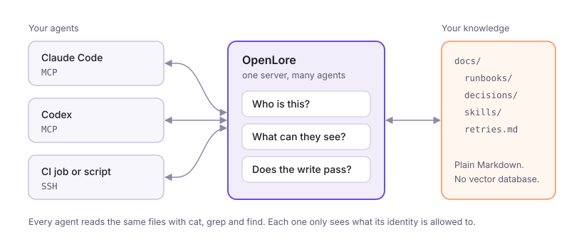

<div align="center">

# 📜 OpenLore

[](https://github.com/aakarim/OpenLore/releases/latest)
[](https://pkg.go.dev/github.com/aakarim/go-openlore)

<a href="https://trendshift.io/repositories/85262?utm_source=trendshift-badge&amp;utm_medium=badge&amp;utm_campaign=badge-trendshift-85262" target="_blank" rel="noopener noreferrer"></a>

Sponsored by <a href="https://oiya.ai/?utm_source=github&amp;utm_medium=referral&amp;utm_campaign=openlore&amp;utm_content=sponsor_logo"></a>

**Serve your docs to AI agents over SSH and MCP.**

</div>

Point OpenLore at a folder of Markdown and every agent on your team reads the same files, whether it's Claude Code, Codex, Cursor or a CI job. Agents use the tools they already know, like `cat`, `grep` and `find`. You decide who can see and change what.

<p align="center">
  
</p>

## Quick start

Install and serve a folder:

```bash
brew install --cask aakarim/tap/lore
openlore ./docs
```

SSH runs on port `2222`. The web view and MCP share port `8080`. The contents of `./docs` appear at `/`.

Connect an agent:

```bash
# Claude Code
claude mcp add --transport http openlore http://localhost:8080/mcp

# Codex
codex mcp add openlore --url http://localhost:8080/mcp

# Anything with a shell
ssh -p 2222 localhost "grep -r 'retry' /"
```

Tell your agents when to use it:

```bash
ssh -p 2222 localhost agents >> AGENTS.md
```

Or let your agent do the whole setup:

```bash
ssh openlore.sh teach | claude
```

Not on Homebrew? See [Installation](#installation) for Linux, Windows and Go.

## Why not just keep Markdown in your repo?

For one agent in one repository, do that.

OpenLore is for when several agents, repositories or people need the same knowledge, and you need to say who can read, write or publish what. Update a file once and every agent sees the new version on its next read.

There's no vector database, ingestion pipeline or SDK. Your knowledge stays as ordinary Markdown.

## Guides

- [What is OpenLore](docs/introduction.md)
- [Claude Code](docs/start-claude-code.md)
- [Codex]
- [Cursor]
- [OpenCode]
- [Any agent over SSH](docs/start-ssh.md)
- [Let an agent publish into an inbox](docs/publish-to-inbox.md)
- [All documentation](https://openlore.sh/docs/)


## Features

- **Agent-native retrieval** — Agents use the shell tools and composition
  patterns they already understand instead of learning a bespoke retrieval API.
- **One knowledge surface, multiple transports** — Serve the same virtual
  filesystem over SSH, SFTP/SSHFS (including direct VS Code browsing and
  editing), MCP, and a human-friendly web view.
- **Live, governed knowledge** — Keep content read-only, allow scoped publishing,
  or enable full writes per docset. Writes are atomic, conflict-aware and
  validated before they commit.
- **Identity-scoped views** — Give each person or agent only the docsets it
  needs, with role-based `ro`, `publish`, and `rw` grants, path aliases, and
  private home directories.
- **Safe by construction** — The shell is an in-memory Go interpreter, not a
  real operating-system shell. There is no shell escape, arbitrary process
  execution, or ambient network access in a normal session.
- **Portable knowledge bundles** — Embed docs into a self-contained binary,
  build cross-platform bundles with the GitHub Action, or package them as a
  desktop MCP extension.
- **Structured knowledge without a new query language** — Inspect frontmatter
  as NDJSON with `lore meta`, query it with `jq`, and validate Google's
  [Open Knowledge Format (OKF)](https://github.com/GoogleCloudPlatform/knowledge-catalog/blob/main/okf/SPEC.md)
  bundles and Agent Skills close to the write path.
- **Extensible policy and processing** — Plugins can add validation, grants,
  read/write middleware, metadata, and post-commit processing while preserving
  the same filesystem interface.

## Use Cases

- **Continuous Learning repository** - store sessions and learnings in one shared server. Add metrics so you can optimise. Allow agents to share learnings with each other while maintaining user isolation.
- **Team Artifact Repository** - share markdown, HTML, JSON, Excel etc. documents you've created while maintaining access controls. Much more natural than git, more agent-native than Confluence/Notion. 
- **Documentation for coding agents** — Put internal API docs, runbooks, product
  context, and architecture notes behind a familiar, greppable interface.
- **A shared live memory for teams of agents** — Give agents separate or shared
  docsets so they can publish findings, hand off work, and accumulate durable
  context across sessions.
- **Public docs site** - add any files to your public docset, enable public access and it will be shown to any agent that stumbles across your site. Improves AEO/GEO with no need to edit your existing docs. 
- **Skills sharing** — Publish Agent Skills into shared collections so every
  authorised agent can discover and use the same governed procedures.
- **Agent Plugins repository** — Version-pin [Agent Plugins](https://agent-plugins.org) repos from GitHub and serve them to your team's agents. Skills packaged in the open standard stay current automatically.
- **Governed knowledge contribution** — Let contributors publish into inboxes
  while reserving existing documents for maintainers and preventing accidental
  overwrites.
- **Artifact repository** — Store and expose reports, logs, screenshots, and
  generated files through the browser or SSH without building a custom artifact
  viewer or granting access to the agent's machine.
- **Identity-specific workspaces** — Mount a private home for each agent plus
  shared team knowledge, all through one server and one authorisation model.
- **Portable customer or project knowledge** — Ship a versioned executable with
  the relevant docs embedded, or distribute the same knowledge as an MCPB
  desktop extension.
- **Validated knowledge catalogues** — Enforce frontmatter and bundle conventions,
  inspect metadata cheaply, and stop malformed knowledge at admission time.

## How It Works

OpenLore is built on [Wish](https://github.com/charmbracelet/wish) for SSH
transport. A connection is handled entirely against a virtual filesystem:

1. **Authenticate** — connect keylessly or resolve an SSH key, certificate,
   passkey, or OAuth login to an identity.
2. **Compose a view** — mount only the docsets and paths granted to that identity.
3. **Explore** — run shell commands implemented as pure Go functions over that
   view, or use the equivalent MCP `shell` tool.
4. **Contribute safely** — if writing is enabled, authorise and validate a
   whole-file change before committing it atomically.

OAuth clients use delegated identities, so durable write provenance distinguishes
direct work by `adil` from work performed as `adil/claude@claude.ai`. Delegates
can inherit no more authority than their principal and can be narrowed by
docset and capability deny lists. CIMD clients can additionally authenticate
with vendor-hosted metadata and `private_key_jwt`; see
[Authenticated OAuth Clients](docs/authenticated-oauth-clients.md).

The normal shell cannot invoke `bash`, `exec`, `curl`, or arbitrary host
processes. Embedded documentation is always read-only. Explicitly trusted
identities can be granted narrowly scoped asynchronous processing through the
`spawn` capability.

## Governed Writing

OpenLore is read-only by default. Writable deployments keep a single,
policy-controlled write path for redirects, append, `tee`, `patch`, `sed -i`,
file moves, publishing, and trusted external jobs.

```bash
echo "# Research" | publish /backend/findings.md
cat change.diff | patch /backend/api.md
sed -i 's/old/new/g' /backend/runbook.md
```

Writes are whole-object atomic swaps. Compare-and-swap protection rejects stale
edits by default, docset grants constrain the target, and plugins can validate
or defer a write before it commits.

See [Writing and publishing](docs/writing.md) for user-facing setup and
[Write system internals](docs/write-system.md) for the implementation model.

## Installation

### Install with Homebrew

Homebrew is supported on macOS and Linux:

```bash
brew install --cask aakarim/tap/lore
```

### Install a Linux release

Download and install the latest x86-64 release:

```bash
curl -L https://github.com/aakarim/OpenLore/releases/latest/download/openlore_linux_amd64.tar.gz | tar xz
sudo install openlore /usr/local/bin/openlore
```

Arm64 archives are published as `openlore_linux_arm64.tar.gz`.

### Install a Windows release

Download and extract the latest 64-bit Windows release from PowerShell:

```powershell
Invoke-WebRequest `
  -Uri https://github.com/aakarim/OpenLore/releases/latest/download/openlore_windows_amd64.zip `
  -OutFile openlore.zip
Expand-Archive openlore.zip -DestinationPath .
.\openlore.exe version
```

### Install with Go

Requires Go 1.26 or later:

```bash
go install github.com/aakarim/go-openlore/cmd/openlore@latest
```

### Build from source

```bash
git clone https://github.com/aakarim/go-openlore.git
cd go-openlore
go build -o openlore ./cmd/openlore
```

This normal Go build is backend-only and does not require Node. Release binaries
and containers include the dashboard; see [Dashboard build and distribution](docs/dashboard-build.md).

### Embed docs in a binary

Place documentation in `assets/lore/` and build. The resulting binary contains
the docs and serves them read-only at `/docs` when run with no directory
argument:

```bash
go build -o my-docs ./cmd/openlore
```

### Build with the GitHub Action

Produce cross-platform binaries with your docs embedded:

```yaml
- uses: aakarim/openlore@v1
  with:
    docs-dir: ./docs
    config: ./openlore.yml
```

See [Ways to use OpenLore](docs/usage.md) for direct VS Code editing, MCP stdio,
MCPB desktop packaging, SSHFS, and Go library usage.

### Create a customised deployment

Use the bundled `setup` skill to create `<team>-lore`, a small customer-owned
repository containing `openlore.yml`, a thin `Containerfile` pinned to an
official OpenLore release, and deployment artifacts. It builds a working local
server and verifies HTTP, MCP, authenticated SSH, writes, and persistence before
deployment:

```bash
ssh openlore.sh setup | amp
```

The generated repository keeps initial `lore.json` policy and SSH-visible files
under gitignored `.local/`. The first deployment initialises an empty persistent
volume from that state. Root `openlore.yml` remains the Git/IaC authority and is
deployed separately to `/var/lib/openlore/config/openlore.yml`; it is not baked
into the image. Later `lore.json` and filesystem edits on the server are
authoritative and are never overwritten by image updates.

Additional instruction commands support the full lifecycle:

- `onboarding` adds initial identities, roles, homes, and folders locally;
- `deploy` selects Fly.io, Railway, AWS, Google Cloud, Azure, DigitalOcean, or a
  custom deployment and verifies a shared persistence/networking contract;
- `upgrade` prepares only the pinned base-image version change so existing CD
  can deploy it.

Provider deployments require HTTPS/MCP, authenticated OpenLore SSH,
administrative shell access, and a persistent `/var/lib/openlore` volume. Where
the provider supports it, deployment configures public port 22 to forward to
OpenLore port 2222. Otherwise it reports the assigned port and recommends an
external TCP forwarding system.

The published container contains only OpenLore. It deliberately contains no
onboarding policy or server configuration. Before the service starts, the
deployment must put `openlore.yml` and `lore.json` in the persistent config
directory and run:

```bash
./out --config /var/lib/openlore/config/openlore.yml
```

This keeps configuration independently deployable: a simple deployment can
copy `openlore.yml` onto the volume, while Kubernetes can project the same file
from a ConfigMap. Use the `deploy` skill for Fly.io, Railway, AWS, Google Cloud,
Azure, DigitalOcean, or custom infrastructure. The repository's Railpack and
Fly files provide the image, persistent-volume, and port wiring; they do not
seed or mutate configuration at process startup.

Railway assigns its SSH TCP proxy a public hostname and port. Standard SSH port
22 requires an external raw TCP load balancer. Fly.io can map public port 22 to
OpenLore's internal port 2222 with a dedicated address. Raw SSH has no hostname
or SNI routing, so one listener cannot route multiple domains on port 22.

The container workflow publishes `latest` from `main`; releases also publish
`VERSION`, `vVERSION`, major, and minor image tags.

## Documentation

| Guide | Contents |
|---|---|
| [Changelog](docs/changelog.md) | Current version, release notes, compatibility notes, and versioned docs |
| [What is OpenLore](docs/introduction.md) | Serve, connect, scope, govern and observe in one page |
| [Claude Code with OpenLore](docs/start-claude-code.md) | Connect Claude Code over MCP and scope what it sees |
| [Any agent with OpenLore over SSH](docs/start-ssh.md) | Connect a coding agent or CI job over SSH and give it an identity |
| [Let an agent publish into an inbox](docs/publish-to-inbox.md) | Accept contributions from an agent without letting it edit anything else |
| [Ways to use OpenLore](docs/usage.md) | SSH, MCP, web, SSHFS, embedded binaries, GitHub Action, MCPB, and library usage |
| [Editing OpenLore files](docs/editors.md) | Direct VS Code and SFTP editor setup without a local project mirror |
| [Command reference](docs/commands.md) | Complete shell, introspection, publishing, syntax, CLI command, and flag reference |
| [Configuration and identity](docs/configuration-and-identity.md) | `openlore.yml`, authentication, roles, docsets, aliases, homes, and host verification |
| [openlore.yml reference](docs/openlore-yml.md) | Generated reference for every key `openlore.yml` accepts |
| [HTTP inbox uploads](docs/inbox.md) | Upload documents with bearer or HMAC credentials |
| [Workload identity federation](docs/workload-identity-federation.md) | Authenticate CI and agents with short-lived external identity tokens |
| [Writing and publishing](docs/writing.md) | Write modes, inboxes, conflict handling, approvals, and jobs |
| [Plugins and knowledge formats](docs/plugins.md) | Plugin installation, interfaces, OKF validation, `lore validate`, and `lore meta` |
| [Folder rules](docs/folder-rules.md) | `.lore/config.yaml` and `lore.json` rules, layering, permissions, rejection messages, and growth limits |
| [Rules standard library](docs/rules-stdlib.md) | Generated reference for compiled-in rule members and their parameters |
| [Write system internals](docs/write-system.md) | Filesystem layering, write seam, admission middleware, and async jobs |
| [Security evaluation](SECURITY.md) | Threat model and security properties |

## Security

- Commands run in a pure-Go interpreter, not through `os/exec`.
- The virtual filesystem cleans paths and enforces docset boundaries.
- Allowed file patterns and ignored directories keep secrets out of the view.
- RBAC controls reads, publishing, writes, approvals, and trusted capabilities.
- The web endpoint can publish the SSH host key over TLS to avoid blind trust on
  first use; SSH user and host certificates are also supported.

See [SECURITY.md](SECURITY.md) for the full security evaluation.

## License

[Apache License 2.0](LICENSE) — Copyright © 2026 Adil Karim

OpenLore bundles third-party open-source components. Their licences and required
notices are listed in
[assets/legal/THIRD_PARTY_NOTICES.md](assets/legal/THIRD_PARTY_NOTICES.md), with
full licence texts in [assets/legal/licenses/](assets/legal/licenses/). These are
embedded in the binary and served by the running service at `/legal`.
